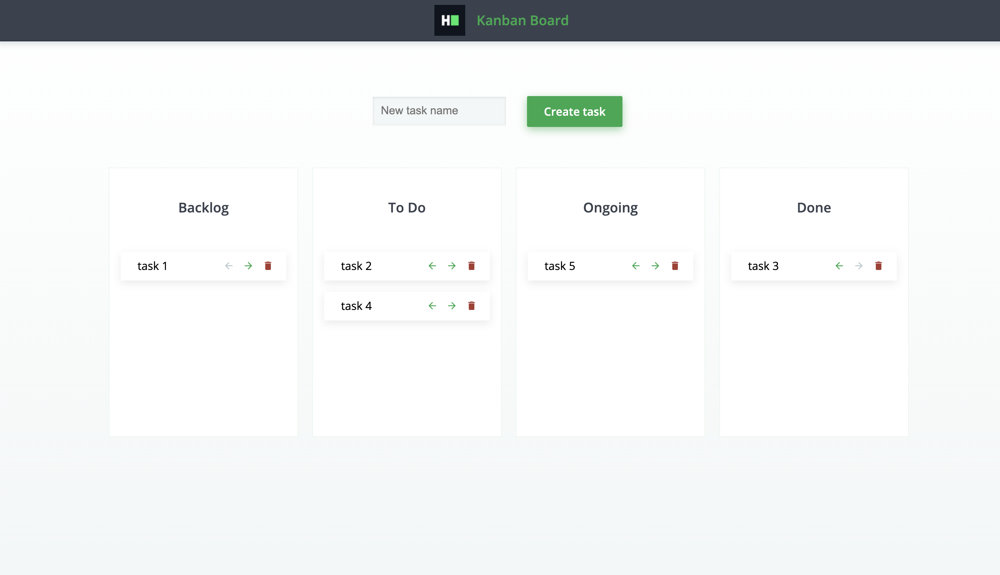

# Kanban Board Tech Test

This project contains 2 directories:

- frontend: contains an angular project for a kanban board.
- backend: contains an nodeJS-Express project for authenticate user and routes for create, get all tasks, get task by id, with api key validation, generation and store.

## Environment

Please use next environment:

```bash
    Angular CLI: 10.0.7
    Node: 12.21.0
```

## Frontend

- After clone this repository you need install dependencies with `npm i` command.
- frontend start with `npm run start` command.
- frontend test with `npm run test` command.

## Backend

- After clone this repository you need install dependencies with `npm i` command.
- backend start with `npm run start` command.
- backend test with `npm run test` command.

## Screenshots




